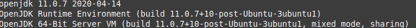

# Android Edge Agent

## A. Introduction
Android Edge Agent is an Android application to run EPI client.

This project is a heavily modified version of Android's native-gradle-node-folder project
from [nodejs-mobile-samples/](https://github.com/janeasystems/nodejs-mobile-samples/).

It uses Node 12.19 as Node platform.

This will basically install Node inside the Android application and
make it run on a free port for the application to connect to.

**Warning**: Please be sure that you have at least 7GB free space on the device you want to make a build.

## B. Build it with Android Studio

### Step 1 - Have Java Development Kit installed

You must have JDK 11 installed. (Probably other versions of JDK - down to 8 - might work as we do not use specific JDK 11 features
but we built it and test it using verison 11)

To see if you have java installed and what version run
```
java --version
```

You should get something like:




If you do not have JDK installed then follow this link - [How to install JDK](https://docs.oracle.com/en/java/javase/11/install/index.html) - to see how to install it on your machine.


### Step 2 - Install Android Studio 4.1

Download version 4.1 from [Download Android Studio](https://developer.android.com/studio) page

__Note__: Please try to to stick with 4.1 of the Studio as any new version (slight increase in version number) might convert and upgrade the project file(s) which might trigger a chain reaction of upgrades that might put whole project into a configration that was not tested yet.

### Step 3 - Install proper dependencies

#### Install NDK
    Menu > Tools > SDK Manager > SDK Tools > Show Package Details > NDK (Side by side) > 21.3.6528147

### Step 4 - Create/open project


### Step 5 - (Optional) Add the Nodejs project

__Note__: SKIP THIS STEP if you are using this repository from inside the [epi-workspace](https://github.com/PharmaLedger-IMI/epi-workspace)
#### a. Copy project's files

Copy project inside app/src/main/assets/**nodejs-project**/ folder


#### b. Bring in all project dependencies
cd  app/src/main/assets/nodejs-project/

npm install
```

### Step 6 - Create proper Android emulator
    Menu > Tools > AVD Manager > + Create Virtual Device... > Phone > Pixel 4 > (Next) >  Release Name (Pie) / API Level 28 > Next > AVD Name: Pixel 4 API 30 > (Finish)


### Step 7 - Run the project

Note: Set proper permissions for application: #App Info > Permissions > (3 dots) > All permissions

## C. Build it from console

### 1. Setup Android SDK

### i. Create Android SDK folder

Create a folder named android (we will use _${android_home}_ to refer to it) and subfolders.
```sh
    mkdir -p ~/${android_home}/sdk/cmdline-tools/latest/
```

#### ii. Download SDK

This is based on the Android SDK, so you need to download it 

Go to https://developer.android.com/studio#downloads and search for "SDK tools package" inside "Command line tools only" section.

#### iii. Unzip it into
Unzip the content of zip file into
```
${android_home}/sdk/cmdline-tools/latest/
```

Make sure you can run __sdkmanager__ from

```
${android_home}/sdk/cmdline-tools/latest/bin/
```

folder.

#### iv. Setup local environment values

Create a local file named **local.properties**
and add 
```
sdk.dir=~/${android__home}/sdk
```

replacing the right value with your path to SDK


### 2. Make sure you can run gradle

__Windows__
Run gradle.bat in Command Prompt

__Linux__
Run gradlew in console.

Tip: If gradlew is not running make it executable with

```sh
chmod +x gradlew
```

### See gradle available task
```sh
./gradle(w) tasks
```


### 3.Install NDK

Inside project's folder type:
```sh
./gradlew -b ndk.gradle installNDK
```


### 4. Build a debug APK
```sh
./gradlew assembleDebug
```

This will create an .apk file inside `app/build/output/apk/debug` folder.

### 5. Install it

If beside building you want to run it on a device
```shell
./gradlew installDebug
```
This will install the application on the default (running) emulator but IT
WILL NOT LAUNCH IT FOR YOU.


### 6. Build a release APK
See this [link](https://developer.android.com/studio/build/building-cmdline#ReleaseMode)


## D. Troubleshooting

You can debug the inner browser (WebView) by typing

```
chrome://inspect
```

inside your Chrome browser.

You will get something like


### Open

More information here: [Remote Debugging WebViews](https://developers.google.com/web/tools/chrome-devtools/remote-debugging/webviews)